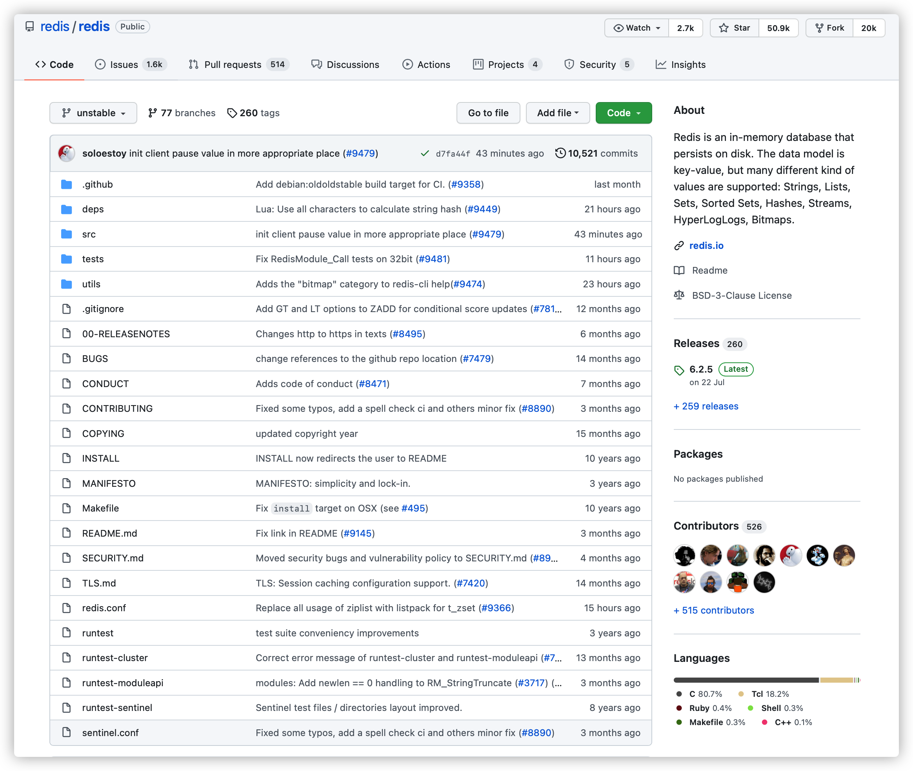
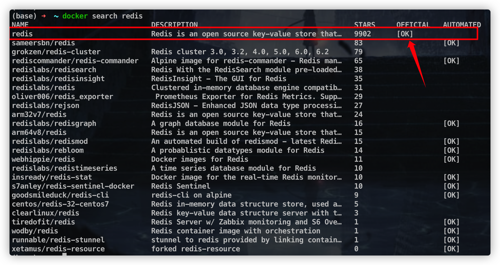
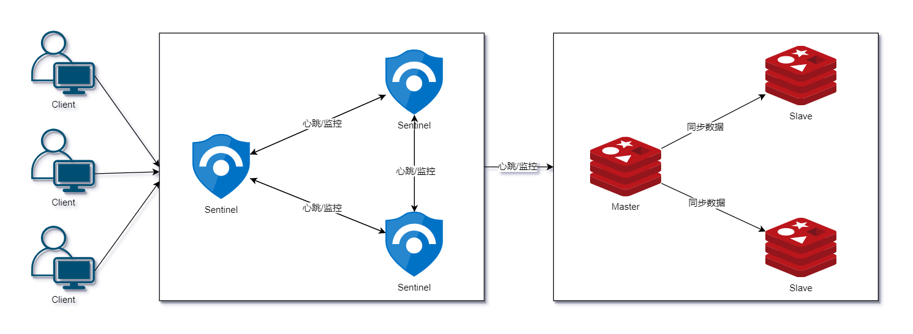

# Redis 的安装和使用

Redis 是一种使用 C 语言编写的高性能内存数据库，支持持久化到磁盘，其中存储的数据模型为 Key Value 的键值对。



## **一、配置实验环境：使用 Docker 安装 Redis**

> Docker 是一种虚拟化技术，基于 Linux 的容器机制（Linux Containers，简称 LXC），你可以把它近似地理解成是一个“轻量级的虚拟机”，只消耗较少的资源就能实现对进程的隔离保护。使用 Docker 可以把应用程序和它相关的各种依赖（如底层库、组件等）“打包”在一起，这就是 Docker 镜像（Docker image）。Docker 镜像可以让应用程序不再顾虑环境的差异，在任意的系统中以容器的形式运行（当然必须要基于 Docker 环境），极大地增强了应用部署的灵活性和适应性。因此，使用 Docker 搭建实验环境，可以最小化环境配置。

1. 在 Docker Hub 中搜索 Redis 镜像文件

第一种方式是上 Docker Hub 的官网仓库搜索：


第二种方式是通过终端命令搜索：

```
docker search redis
```



一般选择这种官方提供的镜像文件，比较安全。

1. 从 Docker Hub 拉取官方的最新版本的镜像文件

```
docker pull redis:latest
```

1. 查看本地镜像

```
docker images
```

1. 运行容器

```
docker run -itd --name redis -p 6379:6379 redis
```

1. 查看运行中的容器

```
docker ps
```

1. 在运行中的容器内部执行命令

```
docker exec -it --name redis /bin/bash
```

1. 在容器内部通过 `redis-cli`命令 连接测试使用 redis 服务

```
redis-cli
```

## **二、实验记录：测试 Redis 的基本操作**

### **字符串（String）**

Redis 字符串数据类型的相关命令用于管理 redis 字符串值。

- `SET key value`：设置指定 key 的值

    ```
    127.0.0.1:6379> set test 1
    OK
    127.0.0.1:6379> set test redis
    OK
    ```

- `GET key`：获取指定 key 的值

    ```
    127.0.0.1:6379> get test
    "redis"
    ```

- `GETRANGE key start end`：返回 key 中字符串值的子字符

    ```
    127.0.0.1:6379> getrange test 0 1
    "re"
    ```

- `GETSET key value`：将给定 key 的值设为 value ，并返回 key 的旧值(old value)

    ```
    127.0.0.1:6379> get test
    "redis"
    127.0.0.1:6379> getset test redis-getset
    "redis"
    127.0.0.1:6379> get test
    "redis-getset"
    ```

- `MGET key1 [key2..]`：获取所有(一个或多个)给定 key 的值

    ```
    127.0.0.1:6379> get test
    "redis-getset"
    127.0.0.1:6379> set test2 test2
    OK
    127.0.0.1:6379> get test2
    "test2"
    127.0.0.1:6379> mget test test2
    1) "redis-getset"
    2) "test2"
    ```

- `STRLEN key`：返回 key 所储存的字符串值的长度

    ```
    127.0.0.1:6379> get test
    "redis-getset"
    127.0.0.1:6379> strlen test
    (integer) 12
    ```

- `MSET key value [key value ...]`：同时设置一个或多个 key-value 对。

    ```
    127.0.0.1:6379> mset k1 v1 k2 v2
    OK
    127.0.0.1:6379> mget k1 k2
    1) "v1"
    2) "v2"
    ```

- `INCR key`：将 key 中储存的数字值增一。

    ```
    127.0.0.1:6379> get k3
    (integer) 1
    127.0.0.1:6379> incr k3
    (integer) 2
    ```

- `INCRBY key increment`：将 key 所储存的值加上给定的增量值（increment）。

    ```
    127.0.0.1:6379> incrby k3 10
    (integer) 12
    ```

- `DECR key`：将 key 中储存的数字值减一。

    ```
    127.0.0.1:6379> decr k3
    (integer) 11
    ```

- `DECRBY key decrement`：key 所储存的值减去给定的减量值（decrement）。

    ```
    127.0.0.1:6379> decrby k3 10
    (integer) 1
    ```

- `APPEND key value`：如果 key 已经存在并且是一个字符串， APPEND 命令将指定的 value 追加到该 key 原来值（value）的末尾。

    ```
    127.0.0.1:6379> append test test_append
    (integer) 23    # 追加后的字符串长度
    127.0.0.1:6379> get test
    "redis-getsettest_append"
    ```

- ...

### **哈希（Hash）**

Redis hash 是一个 string 类型的 **field（字段） 和 value（值） 的映射表**，hash 特别适合用于存储对象。

- `HSET key field value`：将哈希表 key 中的字段 field 的值设为 value。

    ```
    127.0.0.1:6379> hset myhash field1 "foo"
    (integer) 1     # 新添加未存在的 key value 键值对会返回 1
    127.0.0.1:6379> hset myhash field1 "bar"
    (integer) 0     # 覆盖已有的 key 的 value 会返回 0
    127.0.0.1:6379> hset myhash field2 "foo"
    (integer) 1
    ```

- `HGET key field`：获取存储在哈希表中指定字段的值。

    ```
    127.0.0.1:6379> hget myhash field1
    "bar"
    127.0.0.1:6379> hget myhash field2
    "foo"
    ```

- `HEXISTS key field`：查看哈希表 key 中，指定的字段是否存在。

    ```
    127.0.0.1:6379> hexists myhash field1
    (integer) 1     # 哈希表中存在该字段返回 1
    127.0.0.1:6379> hexists myhash field2
    (integer) 1
    127.0.0.1:6379> hexists myhash field3
    (integer) 0     # 哈希表中不存在该字段则返回 0
    ```

- `HDEL key field1 [field2]`：删除一个或多个哈希表字段。

    ```
    127.0.0.1:6379> hdel myhash field1
    (integer) 1     # 删除存在的字段返回 1
    127.0.0.1:6379> hdel myhash field3
    (integer) 0     # 删除不存在的字段则返回 1
    ```

- `HGETALL key`：获取在哈希表中指定 key 的所有字段和值。

    ```
    127.0.0.1:6379> hset myhash field1 "foo"
    (integer) 1
    127.0.0.1:6379> hset myhash field2 "bar"
    (integer) 0
    127.0.0.1:6379> hgetall myhash
    1) "field1"
    2) "foo"
    3) "field2"
    4) "bar"
    ```

- `HKEYS key`：获取所有哈希表中的字段。

    ```
    127.0.0.1:6379> hkeys myhash
    1) "field2"
    2) "field1"
    ```

- `HLEN key`：获取哈希表中字段的数量。

    ```
    127.0.0.1:6379> hlen myhash
    (integer) 2
    ```

- ...

### **列表（List）**

Redis列表是简单的**字符串列表**，按照插入顺序排序。你可以添加一个元素到列表的头部（左边）或者尾部（右边）。

- `LINSERT key BEFORE|AFTER pivot value`：在列表的元素前或者后插入元素。
- `LPUSH key value1 [value2]`：将一个或多个值插入到列表头部。
`RPUSH key value1 [value2]`：将一个或多个值插入到列表尾部。

    ```
    127.0.0.1:6379> lpush mylist v1
    (integer) 1
    127.0.0.1:6379> lpush mylist v2
    (integer) 2
    127.0.0.1:6379> rpush mylist v3
    (integer) 3
    ```

- `LRANGE key start stop`：获取列表指定范围内的元素。

    ```
    127.0.0.1:6379> lrange mylist 0 2 # 索引下标从0开始，左右闭集
    1) "v2"
    2) "v1"
    3) "v3"
    ```

- `LPOP key`：移出并获取列表的第一个元素。
`RPOP key`：移出并获取列表的最后一个元素。

    ```
    127.0.0.1:6379> lpop mylist
    "v2"
    127.0.0.1:6379> rpop mylist
    "v3"
    ```

- `LLEN key`：获取列表长度。

    ```
    127.0.0.1:6379> llen mylist
    (integer) 1
    ```

- `BLPOP key1 [key2 ] timeout`：移出并获取列表的第一个元素， 如果列表没有元素会阻塞列表直到等待超时或发现可弹出元素为止。
- `BRPOP key1 [key2 ] timeout`：移出并获取列表的最后一个元素， 如果列表没有元素会阻塞列表直到等待超时或发现可弹出元素为止。
- `BRPOPLPUSH source destination timeout`：从列表中弹出一个值，将弹出的元素插入到另外一个列表中并返回它； 如果列表没有元素会阻塞列表直到等待超时或发现可弹出元素为止。
- ...

### **集合（Set）**

Redis 的 Set 是 String 类型的**无序集合**。**集合成员是唯一的**，这就意味着集合中不能出现重复的数据。

Redis 中集合是通过哈希表实现的，所以添加，删除，查找的复杂度都是 `O(1)`。

集合还擅长做并集、交集、差集等集合运算。

- `SADD key member1 [member2]`：向集合添加一个或多个成员。

    ```
    127.0.0.1:6379> sadd myset m1 m2 m3
    (integer) 3     # 返回成功插入集合的元素个数
    127.0.0.1:6379> sadd myset m4
    (integer) 1
    ```

- `SCARD key`：获取集合的成员数。

    ```
    127.0.0.1:6379> scard myset
    (integer) 4
    ```

- `SMEMBERS key`：返回集合中的所有成员。

    ```
    127.0.0.1:6379> smembers myset
    1) "m1"
    2) "m2"
    3) "m3"
    4) "m4"
    127.0.0.1:6379> smembers myset2
    1) "m3"
    2) "m5"
    3) "m4"
    ```

- `SUNION key1 [key2]`：返回所有给定集合的并集。

    ```
    127.0.0.1:6379> sunion myset myset2
    1) "m3"
    2) "m4"
    3) "m1"
    4) "m2"
    5) "m5"
    ```

- `SDIFF key1 [key2]`：返回第一个集合与其他集合之间的差集。

    ```
    127.0.0.1:6379> sdiff myset myset2
    1) "m1"
    2) "m2"
    ```

- `SINTER key1 [key2]`：返回给定所有集合的交集。

    ```
    127.0.0.1:6379> sinter myset myset2
    1) "m3"
    2) "m4"
    ```

- `SISMEMBER key member`：判断 member 元素是否是集合 key 的成员。

    ```
    127.0.0.1:6379> sismember myset m1
    (integer) 1     # 包含则返回 1
    127.0.0.1:6379> sismember myset m5
    (integer) 0     # 不包含则返回 0
    ```

- ...

### **有序集合（zset: sorted set）**

Redis **有序集合**和集合一样也是 string 类型元素的集合，且**不允许重复**的成员。每个元素都会关联一个 double 类型的分数 score。redis 正是通过分数来为集合中的成员进行从小到大的排序。

- `ZADD key score1 member1 [score2 member2]`：向有序集合添加一个或多个成员，或者更新已存在成员的分数。

    ```
    127.0.0.1:6379> ZADD runoobkey 1 redis
    (integer) 1
    127.0.0.1:6379> ZADD runoobkey 2 mongodb
    (integer) 1
    127.0.0.1:6379> ZADD runoobkey 3 mysql
    (integer) 1
    127.0.0.1:6379> ZADD runoobkey 3 mysql
    (integer) 0
    127.0.0.1:6379> ZADD runoobkey 4 mysql
    (integer) 0
    ```

- `ZRANGE key start stop [WITHSCORES]`：通过索引区间返回有序集合指定区间内的成员。

    ```
    127.0.0.1:6379> ZRANGE runoobkey 0 10 WITHSCORES
    1) "redis"
    2) "1"
    3) "mongodb"
    4) "2"
    5) "mysql"
    6) "4"
    ```

- `ZCARD key`：获取有序集合的成员数。

    ```
    127.0.0.1:6379> ZCARD runoobkey
    (integer) 3
    ```

- `ZREVRANK key member`：返回有序集合中指定成员的排名，有序集成员按分数值递减(从大到小)排序。

    ```
    127.0.0.1:6379> ZREVRANK runoobkey redis
    (integer) 2
    127.0.0.1:6379> ZREVRANK runoobkey mongodb
    (integer) 1
    127.0.0.1:6379> ZREVRANK runoobkey mysql
    (integer) 0
    ```

- ...

### **各种数据类型的使用场景**

[Untitled](https://www.notion.so/2dc99cf7733c4df0b98963c6aa9ff73f)

## **三、了解 Redis 的架构模式**

### **单机模式**


单机模式顾名思义就是只安装一个 Redis，启动起来，业务调用即可。例如一些简单的应用，并非必须保证高可用的情况下可以使用该模式。单机 Redis 能够承载的 QPS（每秒查询速率）大概在几万左右。假设上千万、上亿用户同时访问 Redis，QPS 达到 10 万+。这些请求过来，单机 Redis 直接就挂了。系统的瓶颈就出现在 Redis 单机问题上，此时我们可以通过**主从复制**解决该问题，实现系统的高并发。

### **主从复制**


Redis 的**复制（Replication）**功能允许用户根据一个 Redis 服务器来创建任意多个该服务器的复制品，其中被复制的服务器为**主服务器（Master）**，而通过复制创建出来的复制品则为**从服务器（Slave）**。 只要主从服务器之间的网络连接正常，主服务器就会将写入自己的数据**同步更新**给从服务器，从而保证主从服务器的数据相同。

数据的复制是**单向**的，只能由主节点到从节点，简单理解就是**从节点只支持读操作**，不允许写操作。主要是读高并发的场景下用主从架构。主从模式需要考虑的问题是：当 Master 节点宕机，需要**选举**产生一个新的 Master 节点，从而保证服务的高可用性。

### **哨兵模式**



主从模式中，当主节点**宕机**之后，从节点是可以作为主节点顶上来继续提供服务，但是需要修改应用方的主节点地址，还需要命令所有从节点去复制新的主节点，整个过程需要人工干预。

于是，在 Redis 2.8 版本开始，引入了**哨兵（Sentinel）**这个概念，在**主从复制的基础**上，哨兵实现了**自动化故障恢复**。

Sentinel（哨兵）是Redis 的**高可用**性解决方案：由一个或多个Sentinel 实例组成的 Sentinel 系统可以监视任意多个主服务器，以及这些主服务器属下的所有从服务器，并在被监视的主服务器进入下线状态时，自动将下线主服务器属下的某个从服务器升级为新的主服务器。

## **四、了解 Redis 的使用场景**

Redis 适合的场景：

- 存储用户信息（比如会话）、配置文件、参数、购物车等等，并且这些信息都和用户 ID 挂钩，所以我们可以通过 KV 数据库来存储用户的 ID 作为键，其余用户信息作为对应的值，实现快速检索用户信息。

Redis 不适合的场景如下：

- 需要通过值来查询的场景：KV 数据库只能通过键来查询值，而不能通过值来查询键。
- 需要存储数据之间的关系：KV 数据库不能通过两个或以上的键来关联数据。
- 需要事务的支持：KV 数据库在故障发生时不可以进行回滚。

## **五、TODO**

- Redis 高级数据结构
- 深入了解 Redis 的哨兵机制
- 搭建 Redis 集群
- Redis 持久化机制（AOF & RDB）
- Redis 分布式锁